.. _k3z-yield-curve-comparisons:

Yield Curve Comparisons
=======================

Purpose
-------

This page surfaces the current K3Z treated-yield comparison figures in a place
students can reach directly from the main guide flow.

These figures compare the managed treated curve reconstructed directly from the
current checked-in BatchTIPSY output file
``data/04_output-tsak3z.csv`` against the corresponding VDYP reference curve
for each treated AU shown here.

Use this page when you want to answer questions such as:

- which treated AUs currently have comparison plots;
- how the managed TIPSY curve differs in shape or timing from the VDYP
  reference curve;
- whether the current treated-curve story looks plausible enough for teaching
  and interpretation.

How To Read These Figures
-------------------------

- Treat each figure as a one-AU comparison between the raw BatchTIPSY managed
  curve and the corresponding VDYP reference curve.
- Focus first on broad shape: early growth, peak timing, and whether the two
  curves stay close or diverge strongly at older ages.
- Use the figures as interpretation aids, not as a substitute for the
  underlying exported curves, tracks, or account surfaces.
- In these figures, VDYP is shown as the comparison/QA reference rather than as
  the managed treated curve source.
- For the full catalog of K3Z figures and source filenames, use
  :ref:`k3z-figure-appendix`.

Current Coverage
----------------

The current treated comparison set on this page is rendered directly from the
currently checked-in raw BatchTIPSY output file, so it reflects the treated AUs
present in that artifact.

Current TIPSY-vs-VDYP Gallery
-----------------------------

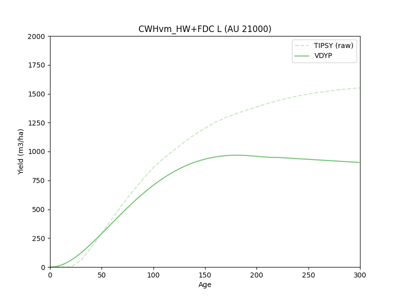

   Raw BatchTIPSY-vs-VDYP treated yield-curve comparison for AU ``21000``.

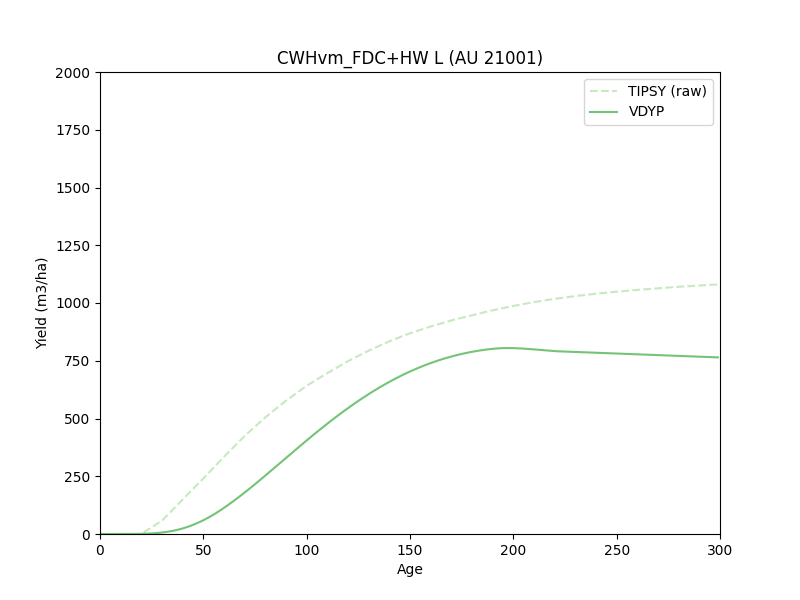

   Raw BatchTIPSY-vs-VDYP treated yield-curve comparison for AU ``21001``.

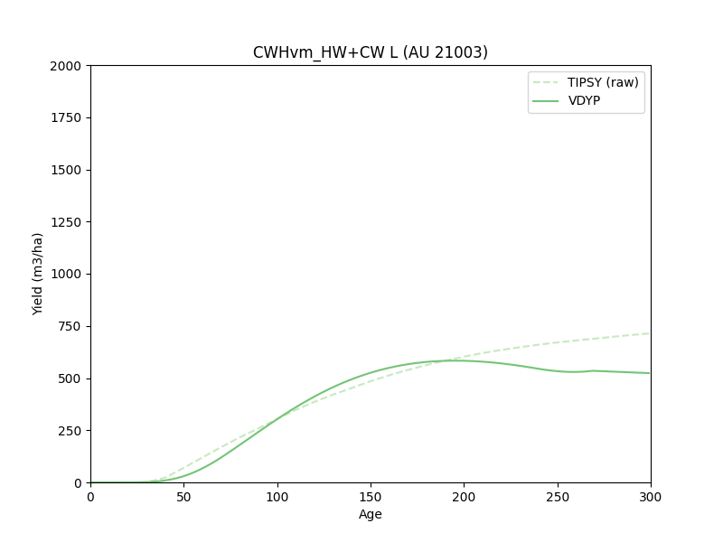

   Raw BatchTIPSY-vs-VDYP treated yield-curve comparison for AU ``21003``.

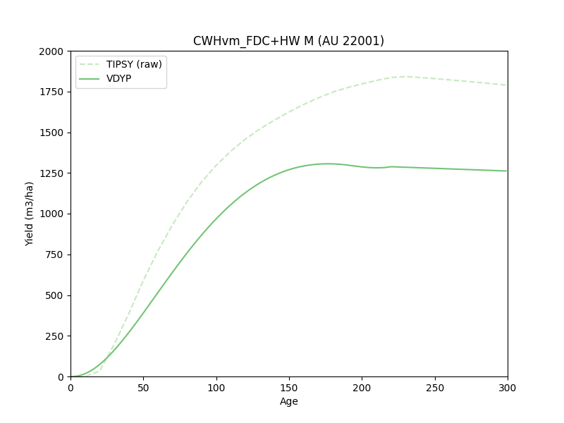

   Raw BatchTIPSY-vs-VDYP treated yield-curve comparison for AU ``22001``.

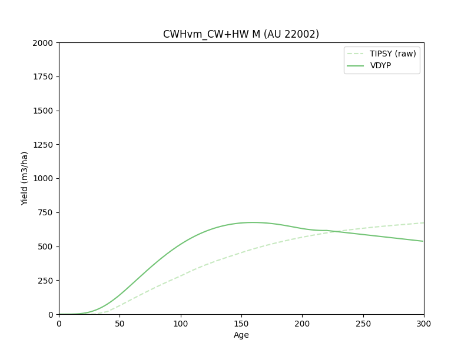

   Raw BatchTIPSY-vs-VDYP treated yield-curve comparison for AU ``22002``.

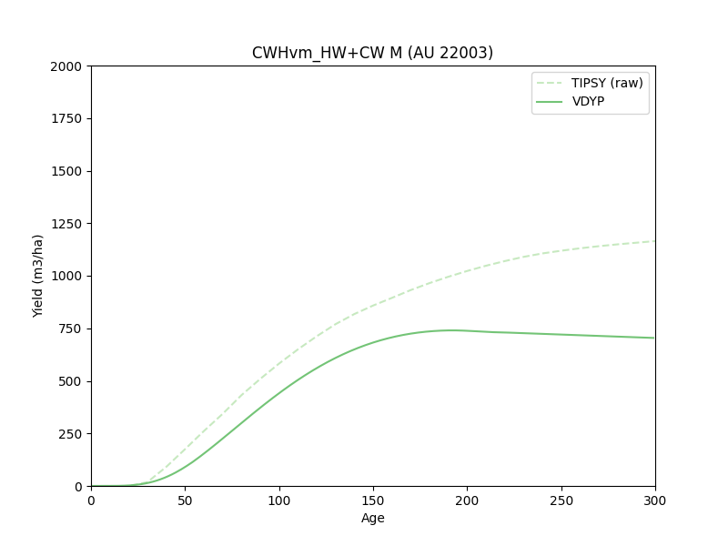

   Raw BatchTIPSY-vs-VDYP treated yield-curve comparison for AU ``22003``.

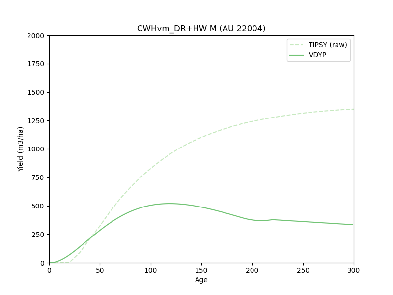

   Raw BatchTIPSY-vs-VDYP treated yield-curve comparison for AU ``22004``.

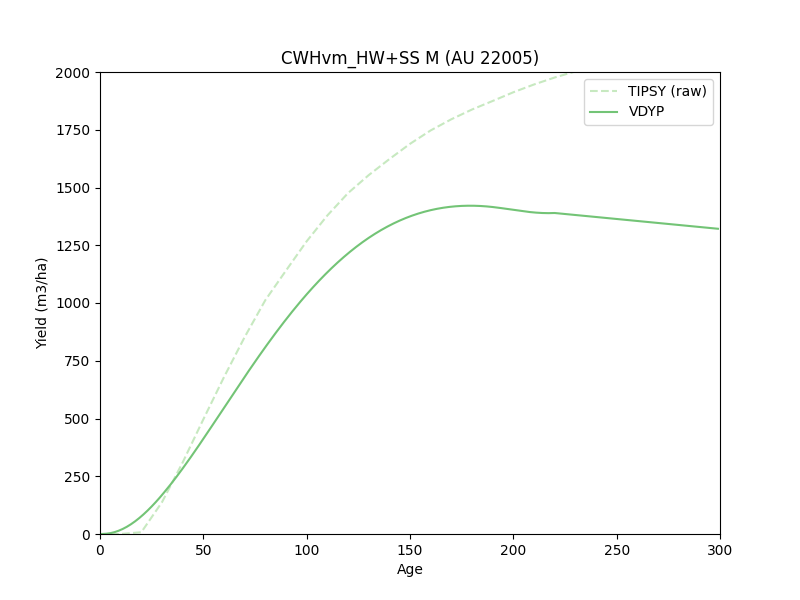

   Raw BatchTIPSY-vs-VDYP treated yield-curve comparison for AU ``22005``.

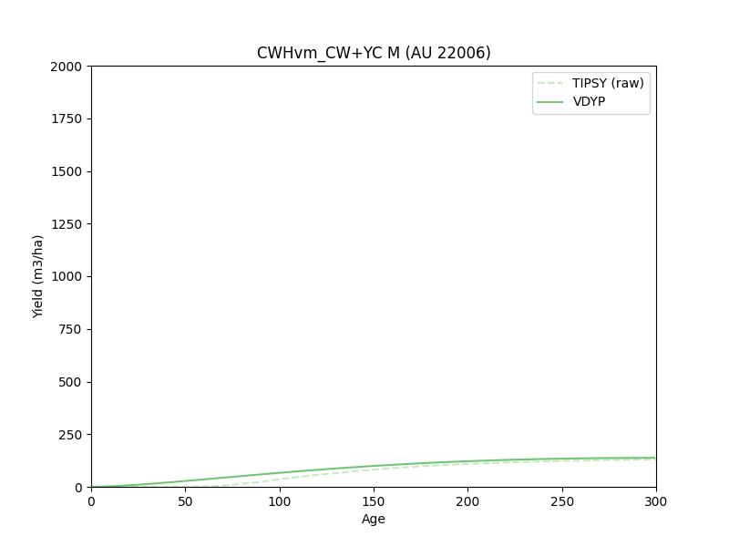

   Raw BatchTIPSY-vs-VDYP treated yield-curve comparison for AU ``22006``.

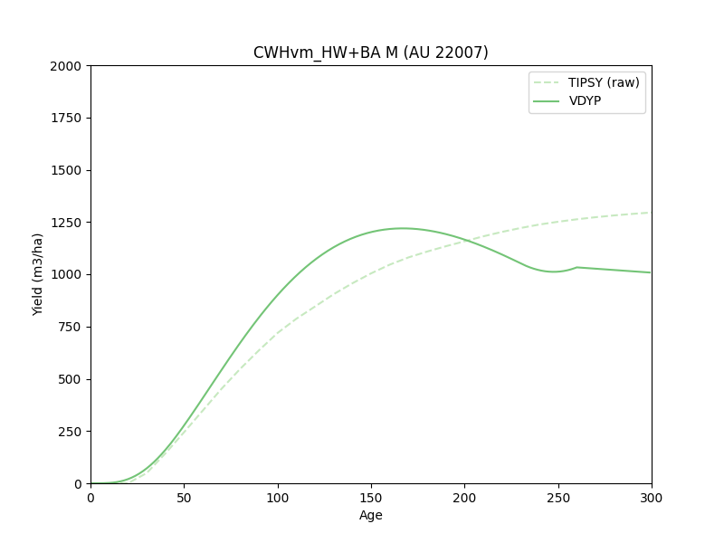

   Raw BatchTIPSY-vs-VDYP treated yield-curve comparison for AU ``22007``.

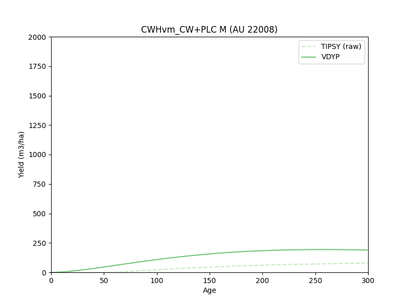

   Raw BatchTIPSY-vs-VDYP treated yield-curve comparison for AU ``22008``.

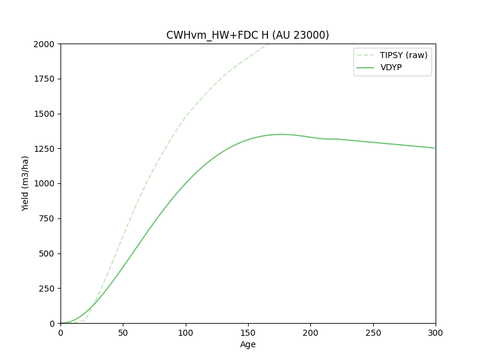

   Raw BatchTIPSY-vs-VDYP treated yield-curve comparison for AU ``23000``.

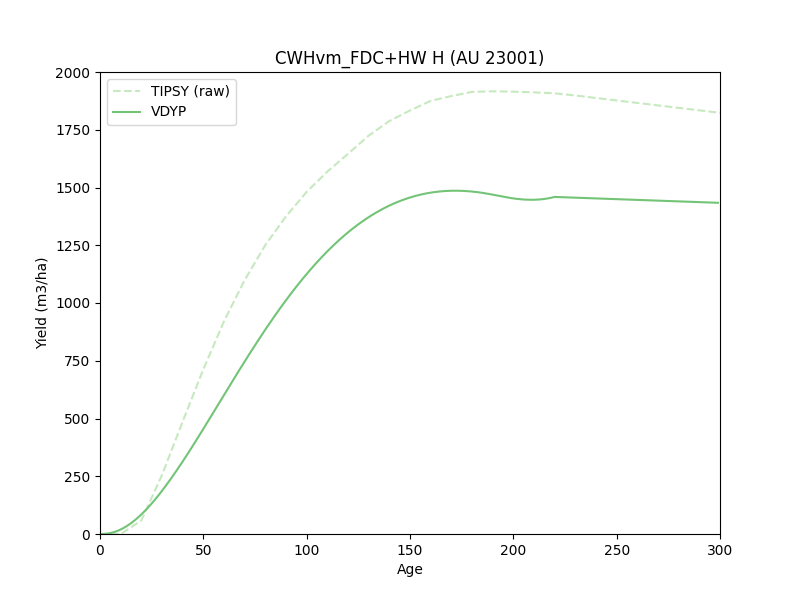

   Raw BatchTIPSY-vs-VDYP treated yield-curve comparison for AU ``23001``.

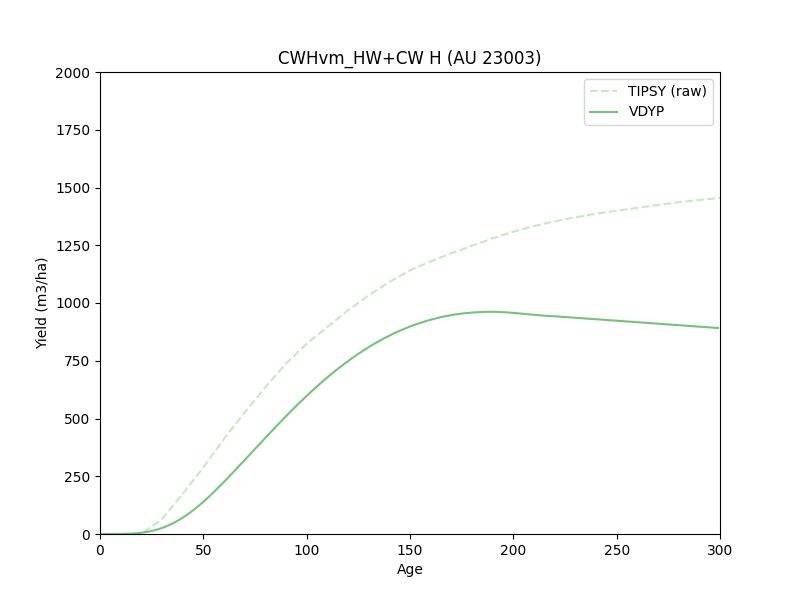

   Raw BatchTIPSY-vs-VDYP treated yield-curve comparison for AU ``23003``.

Where These Figures Come From
-----------------------------

- Plot files live under ``plots/`` in this instance checkout.
- The current overlays on this page were regenerated from
  ``data/04_output-tsak3z.csv`` plus ``data/vdyp_curves_smooth-tsak3z.feather``.
- The current rendered source filenames are retained in
  :ref:`k3z-figure-appendix`.
- Rebuild and QA guidance for regenerating or checking these figures lives in
  :doc:`rebuild-and-qa` and :doc:`operator-runbook`.
